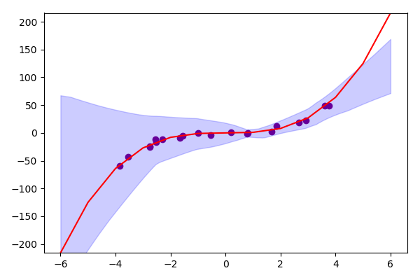

# Predictive Uncertainty Estimation with Neural Networks

## Ensemble.py
The code in `ensemble.py` attempts to reproduce the toy example described in the paper:
_Simple and Scalable Predictive Uncertainty Estimation using Deep Ensembles_
by Balaji Lakshminarayanan, Alexander Pritzel, Charles Blundell, from DeepMind, and
accepted at NIPS 2017 (http://bit.ly/2C9Z8St). An ensemble of nets, together with a special architecture that allows the computation of a negative log likelihood-loss for regression, is used to estimate the uncertainty.
I did not (yet) implement the fast gradient sign method to generate adversarial example.

## Dropout.py
The code in `dropout.py` is essentially the code of Yumi (http://bit.ly/2TEjaeW), adapted to the toy example also used in `ensemble.py`.
The paper that explains why this work is:
_Dropout as a Bayesian Approximation: Representing Model Uncertainty in Deep Learning_
by Yarin Gal, Zoubin Ghahramani, from the University of Cambridge, and accepted at
ICML 2016 (https://arxiv.org/pdf/1506.02142.pdf). Here, uncertainty is estimated by means of dropout.

